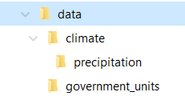

> ## Learning Objectives {.objectives}
>
> * Load spatial data into R
> * Intersect two polygon layers
> * Aggregate a raster across a list of spatial polygons

Once you have decided to use simple random sampling to choose your sites, how do you do it? There are two steps.

* Create or obtain a vector of all possible sampling units
* Use `sample()` to select the units you will use. 

This topic focuses on the first problem. 
In the following we load a dataset that provides a list of Nebraska Counties and their boundaries, and a 2nd dataset that has a raster of average annual precipitation across Nebraska. 
I obtained the original datasets from the [NRCS Geospatial Data Gateway][NGG]. However there are several steps involved in downloading data, so to ensure we all have the same data I have placed two zip files in a public folder on the UNL Box server. [The county boundaries are here][county_data] and [the annual average precipitation data are here][precip_data]. After you download these files extract them into a data subdirectory of your project directory. You did create a fresh project directory, right? Your directory tree should look like this:

If it doesn't, just be sure to modify the paths 
in the code below so that it works. As always, I 
assume that you have started RStudio with a project,
and that the working directory is the project directory. 

We need three packages to work with shapefiles. The first is `sp`, which has the standard spatial 
datastructures for R.  
The second package, `rgdal` you need to read the shape files. To do the intersection of the two layers we need the `rgeos` package. So:

~~~{.r}
#install.packages(c("sp", "rgeos, rgdal")) # if needed
library(sp)
library(rgeos)
~~~

~~~{.output}
rgeos version: 0.3-12, (SVN revision 498)
 GEOS runtime version: 3.4.2-CAPI-1.8.2 r3921 
 Linking to sp version: 1.2-0 
 Polygon checking: TRUE 

~~~

~~~{.r}
library(rgdal)
~~~

~~~{.output}
Loading required package: methods

~~~

~~~{.output}
rgdal: version: 1.0-7, (SVN revision 559)
 Geospatial Data Abstraction Library extensions to R successfully loaded
 Loaded GDAL runtime: GDAL 1.11.2, released 2015/02/10
 Path to GDAL shared files: C:/Users/Drew/Documents/R/win-library/3.2/rgdal/gdal
 GDAL does not use iconv for recoding strings.
 Loaded PROJ.4 runtime: Rel. 4.9.1, 04 March 2015, [PJ_VERSION: 491]
 Path to PROJ.4 shared files: C:/Users/Drew/Documents/R/win-library/3.2/rgdal/proj
 Linking to sp version: 1.2-0 

~~~

We read in the two shapefiles using the layer names without the file extensions. 

~~~{.r}
counties <- readOGR("data/government_units", layer = "county_nrcs_a_ne")
~~~

~~~{.output}
OGR data source with driver: ESRI Shapefile 
Source: "data/government_units", layer: "county_nrcs_a_ne"
with 93 features
It has 28 fields

~~~

~~~{.r}
class(counties)
~~~

~~~{.output}
[1] "SpatialPolygonsDataFrame"
attr(,"package")
[1] "sp"

~~~

~~~{.r}
plot(counties)
~~~

~~~{.r}
annual_precip <- readOGR("data/climate/precipitation", layer = "precip1981_2010_a_ne")
~~~

~~~{.output}
OGR data source with driver: ESRI Shapefile 
Source: "data/climate/precipitation", layer: "precip1981_2010_a_ne"
with 23 features
It has 3 fields

~~~

~~~{.r}
class(annual_precip)
~~~

~~~{.output}
[1] "SpatialPolygonsDataFrame"
attr(,"package")
[1] "sp"

~~~

~~~{.r}
plot(annual_precip)
~~~

So we've managed to load in both layers. 
There are many functions that can read
ESRI shapefiles. `readOGR()` from package
`rgdal` has an important advantage however.
It also loads the *spatial projection*
information present in the file. The next
step is to use the precipitation data to add
some information to each of the polygons in
the county data. We also want to extract the
area of each county. The goal is to obtain a
`data.frame` object with one row for each 
county. It needs ID, area, and mean 
precipitation columns. 

~~~{.r}
# extract the dataframe from counties
sample_frame <- as.data.frame(counties)
# take a look at the variables
names(sample_frame) # lots of stuff
~~~

~~~{.output}
 [1] "OBJECTID"   "FIPS_C"     "FIPS_I"     "FIPSST"     "FIPSCO"    
 [6] "STPO"       "COUNTYNAME" "CNTYDISP"   "CNTYSHORT"  "CNTYSORT"  
[11] "CNTYCATEGO" "CNTYACTIVE" "INDEPCITY"  "CNTYSTAND"  "SEATLAT"   
[16] "SEATLONG"   "NAD83UTM"   "NAD83STATE" "NAD27STATE" "STATENAME" 
[21] "CNTYSTARTD" "CNTYENDD"   "LASTCHGD"   "NOTE"       "BOTTOM"    
[26] "TOP_"       "LEFT_"      "RIGHT_"    

~~~

~~~{.r}
sample_frame <- sample_frame[,c("OBJECTID","COUNTYNAME")]
# extract precipitation information for each county
head(over(counties, annual_precip, returnList = TRUE))
~~~

~~~{.output}
[[1]]
  PrecipInch FIPS_S Inches
4         17     31     17
5         18     31     18
6         19     31     19
7         20     31     20

[[2]]
   PrecipInch FIPS_S Inches
4          17     31     17
5          18     31     18
6          19     31     19
7          20     31     20
8          21     31     21
9          22     31     22
10         23     31     23

[[3]]
  PrecipInch FIPS_S Inches
3         16     31     16
4         17     31     17
5         18     31     18
6         19     31     19

[[4]]
   PrecipInch FIPS_S Inches
13         26     31     26
14         27     31     27
15         28     31     28

[[5]]
   PrecipInch FIPS_S Inches
16         29     31     29

[[6]]
   PrecipInch FIPS_S Inches
15         28     31     28
16         29     31     29
17         30     31     30

~~~

The function `over()` does all spatial intersection operations in `sp`. 
By setting `returnList = TRUE` `over()` returns a list with one 
component for each polygon in `counties`. Inside each component is the 
information from all polygons in `annual_precip` that intersect with 
that polygon of `counties`. So the first county intersects with 4 precipitation 
polygons with average annual precipitation between 17 and 20 inches. 
We need to aggregate those 4 values into one. If we leave `returnList = FALSE` (the default), we get just one value per row

~~~{.r}
head(over(counties, annual_precip))
~~~

~~~{.output}
  PrecipInch FIPS_S Inches
1         17     31     17
2         17     31     17
3         16     31     16
4         26     31     26
5         29     31     29
6         28     31     28

~~~

But the problem is that `over()` has just returned the precipitation of the first polygon.
A better way to do aggregate is to calculate the mean. 
`over()` has an argument `fn` that specifies the function to use for aggregation.

~~~{.r}
head(over(counties, annual_precip, fn = mean))
~~~

~~~{.error}
Warning in mean.default(X[[i]], ...): argument is not numeric or logical:
returning NA

Warning in mean.default(X[[i]], ...): argument is not numeric or logical:
returning NA

~~~

~~~{.output}
  PrecipInch FIPS_S Inches
1       18.5     NA   18.5
2       20.0     NA   20.0
3       17.5     NA   17.5
4       27.0     NA   27.0
5       29.0     NA   29.0
6       29.0     NA   29.0

~~~

That's better. The warnings arise because the FIPS_S field is something that taking a mean of is nonsensical. 
I also just want one of those columns.

~~~{.r}
sample_frame <- cbind(sample_frame,
                      Precip = over(counties, annual_precip, fn = mean)$PrecipInch)
~~~

I also want to extract the area of each county. To do this I pull out the list of polygons, 
and ask each polygon for it's area. These are S4 objects so the `@` operator
is used instead of `$`. 

~~~{.r}
slotNames(counties)
~~~

~~~{.output}
[1] "data"        "polygons"    "plotOrder"   "bbox"        "proj4string"

~~~

~~~{.r}
slotNames(counties@polygons) # no slots ... 
~~~

~~~{.output}
NULL

~~~

~~~{.r}
class(counties@polygons)
~~~

~~~{.output}
[1] "list"

~~~

~~~{.r}
class(counties@polygons[[1]])
~~~

~~~{.output}
[1] "Polygons"
attr(,"package")
[1] "sp"

~~~

~~~{.r}
slotNames(counties@polygons[[1]]) # there it is!
~~~

~~~{.output}
[1] "Polygons"  "plotOrder" "labpt"     "ID"        "area"     

~~~

~~~{.r}
sample_frame$area <- sapply(counties@polygons, function(x) x@area)

head(sample_frame)
~~~

~~~{.output}
  OBJECTID COUNTYNAME Precip        area
0       67      Chase   18.5  2323948967
1       68     Cherry   20.0 15559306937
2       69   Cheyenne   17.5  3096764800
3       70       Clay   27.0  1484840545
4       71     Colfax   29.0  1083386436
5       72     Cuming   29.0  1487107313

~~~

And now we're ready to pick a random sample!

[NGG]: https://gdg.sc.egov.usda.gov/
[county_data]: https://unl.box.com/s/hhmwj9glyr785ixzdbo8fubkirljwg6c
[precip_data]: https://unl.box.com/s/l6tzuuc79kiyiyaytbgm0u05ea2teahu
