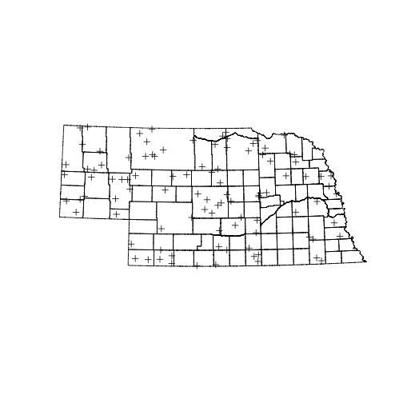

> ## Learning Objectives {.objectives}
>
> * Explore the use of the R function `sample()`

Once you have decided to use simple random sampling to choose your sites, how do you do it? There are two steps.

* Create or obtain a vector of all possible sampling units
* Use `sample()` to select the units you will use. 

We've already done the first step. So now we look at the next step, picking our 
random sample. The `sample()` function will choose a random sample of `size = n` with or without replacement.

~~~{.r}
# code to be executed
sampleFrame <- as.character(1:1000)
sampleIndex <- sample(sampleFrame, size = 50, replace = TRUE)
sampleIndex
~~~

~~~{.output}
 [1] "359" "799" "114" "881" "901" "216" "922" "896" "886" "893" "421"
[12] "602" "988" "829" "894" "136" "760" "825" "687" "468" "56"  "111"
[23] "527" "997" "248" "497" "667" "321" "641" "459" "471" "902" "818"
[34] "7"   "462" "475" "968" "290" "170" "447" "891" "804" "535" "188"
[45] "216" "411" "602" "520" "632" "906"

~~~

The first argument to `sample()` is the sampleFrame, the vector with the ID of each sample unit. The second argument size indicates the number of units to sample. The first argument describes whether the sample is drawn with replacement or not.

> ## Challenge: Drawing random samples {.challenge}
>
> Write R code to do the following tests:
>
> 1. Draw two random samples of the same size from 
>  the same frame. How many units from the 
>  first sample are also in the second?  
> 2. Take a sample of size 200 
>  with replacement set to TRUE. How many units 
>  are duplicated?

So using our data.frame of Nebraska Counties, a size of 10 and without replacement:

~~~{.r}
simple_sample <- sample(sample_frame$COUNTYNAME, size = 10, replace = FALSE)
simple_sample
~~~

~~~{.output}
 [1] Nemaha     York       Wheeler    Custer     Dawes      Valley    
 [7] Banner     Dundy      Richardson Kearney   
93 Levels: Adams Antelope Arthur Banner Blaine Boone Box Butte ... York

~~~

And there you go! What's that? Your list of 10 is different from mine?
Yes, and that is expected. Computers generate random numbers from iterative algorithms
that start with a "seed" value. If you do not use the same seed then the sequence of random 
numbers will be different. Most of the time that's what you want.
However, if you want your calculations to be exactly
reproducible you need to explicitly set the seed of 
the random number generator. The value you give it
doesn't matter. As long as you set the seed the 
sequence of random numbers that follow will be 
exactly the same. 

~~~{.r}
sample(1:1000, size = 10)
~~~

~~~{.output}
 [1] 979 431 781 153 468 638 659  76 695 594

~~~

~~~{.r}
sample(1:1000, size = 10) # different
~~~

~~~{.output}
 [1] 673 157 113 997 567 171 264 123  32 690

~~~

~~~{.r}
set.seed(3987274)
sample(1:1000, size = 10)
~~~

~~~{.output}
 [1] 877 290 236 595 307 771 414  35 486 584

~~~

~~~{.r}
set.seed(3987274)
sample(1:1000, size = 10) # same! 
~~~

~~~{.output}
 [1] 877 290 236 595 307 771 414  35 486 584

~~~

There are a few problems with our simple random sample of counties.
Each county has the same probability of being selected, despite the fact that they 
have different areas. In effect, this means that a bit of ground in Lancaster county has
a higher probability of being selected
than a bit of ground in Cherry county. To get
around this we need to weight the probability
of choosing each county by its area. This is
called a "probability proportional to size" sample. `sample()` has an argument called `prob` which takes a numeric vector. The only condition is that all the elements of this 
vector have to be positive. 

~~~{.r}
set.seed(39858309)
sample(sample_frame$COUNTYNAME, size = 10, prob = sample_frame$area)
~~~

~~~{.output}
 [1] Knox     Sioux    Webster  Cherry   Dawes    Cuming   Frontier
 [8] Custer   Sheridan Arthur  
93 Levels: Adams Antelope Arthur Banner Blaine Boone Box Butte ... York

~~~

> ## Challenge:  {.challenge}
>
> Draw a sample that is larger than the sample 
>  frame.
>

There is another way we might want to sample
a geographical space. It's possible that we
want to choose random points within a
particular area. Each spatial polygon has a
"bounding box" associated with it. 

~~~{.r}
bbox(counties)
~~~

~~~{.output}
        min      max
x 159215.36 900447.3
y  18672.44 359430.7

~~~

These have units of meters, which you can 
see by checking the projection information. 
Look for `+units=m`.

~~~{.r}
proj4string(counties)
~~~

~~~{.output}
[1] "+proj=lcc +lat_1=40 +lat_2=43 +lat_0=39.83333333333334 +lon_0=-100 +x_0=500000 +y_0=0 +datum=NAD83 +units=m +no_defs +ellps=GRS80 +towgs84=0,0,0"

~~~

So, we can pick a random point between two 
values using `runif()`, which is a random
sample from a uniform distribution.

~~~{.r}
bb <- bbox(counties)
runif(1,min=bb[1,1],max=bb[1,2])
~~~

~~~{.output}
[1] 244246.5

~~~

So we can pick 100 samples in both x and y
dimensions like this:

~~~{.r}
rand_points <- data.frame(x = runif(100, min=bb[1,1],max=bb[1,2]),
                          y = runif(100, min=bb[2,1],max=bb[2,2]))
~~~

Figuring out exactly where those points are
can be tricky, but to make a map we need to
put the coordinates into a spatialpointsDataFrame 
object that has the same projection
information as the counties spatialPolygonsDataFrame does. 

~~~{.r}
rp <- SpatialPoints(rand_points,proj4string = CRS(proj4string(counties)))
plot(counties)
plot(rp, add=TRUE)
~~~

The problem with this simple approach is 
obvious. Some of the points selected are 
outside Nebraska because the state is not
a perfect match for it's bounding box. The 
function `over()` can help here

~~~{.r}
head(over(rp, counties))
~~~

~~~{.output}
  OBJECTID FIPS_C FIPS_I FIPSST FIPSCO STPO COUNTYNAME
1     1918  31131  31131     31    131   NE       Otoe
2     1919  31165  31165     31    165   NE      Sioux
3       85  31101  31101     31    101   NE      Keith
4     2543  31159  31159     31    159   NE     Seward
5       73  31041  31041     31    041   NE     Custer
6       NA   <NA>     NA   <NA>   <NA> <NA>       <NA>
                 CNTYDISP  CNTYSHORT  CNTYSORT CNTYCATEGO CNTYACTIVE
1   Otoe County, Nebraska   OTOE, NE   NE-Otoe     County          Y
2  Sioux County, Nebraska  SIOUX, NE  NE-Sioux     County          Y
3  Keith County, Nebraska  KEITH, NE  NE-Keith     County          Y
4 Seward County, Nebraska SEWARD, NE NE-Seward     County          Y
5 Custer County, Nebraska CUSTER, NE NE-Custer     County          Y
6                    <NA>       <NA>      <NA>       <NA>       <NA>
  INDEPCITY CNTYSTAND  SEATLAT   SEATLONG NAD83UTM NAD83STATE NAD27STATE
1         N         Y 40.67667  -95.85889    26914      32104      32006
2         N         Y 42.68722 -103.88222    26913      32104      32005
3         N         Y 41.12806 -101.71917    26914      32104      32006
4         N         Y 40.90694  -97.09861    26914      32104      32006
5         N         Y 41.40194  -99.63889    26914      32104      32006
6      <NA>      <NA>       NA         NA       NA         NA         NA
  STATENAME CNTYSTARTD CNTYENDD   LASTCHGD NOTE   BOTTOM     TOP_
1  Nebraska       <NA>     <NA> 2003/02/24 <NA> 40.52273 40.78445
2  Nebraska       <NA>     <NA> 2003/02/24 <NA> 42.00050 43.00171
3  Nebraska       <NA>     <NA> 2003/02/24 <NA> 41.00268 41.39552
4  Nebraska       <NA>     <NA> 2003/02/24 <NA> 40.69784 41.04687
5  Nebraska       <NA>     <NA> 2003/02/24 <NA> 41.04622 41.74159
6      <NA>       <NA>     <NA>       <NA> <NA>       NA       NA
       LEFT_     RIGHT_
1  -96.46383  -95.70997
2 -104.05315 -103.40097
3 -102.05573 -101.24996
4  -97.36851  -96.91059
5 -100.25293  -99.20326
6         NA         NA

~~~

So overlaying counties onto the points gives
us missing values for all the points outside
of Nebraska. We can use this to filter our
sample. That would leave us with less than 
100 points. So instead we choose many more
points than we want, and then randomly sample
100 from the ones that are inside Nebraska.

~~~{.r}
rand_points <- data.frame(x = runif(400, min=bb[1,1],max=bb[1,2]),
                          y = runif(400, min=bb[2,1],max=bb[2,2]))
rp <- SpatialPoints(rand_points,proj4string = CRS(proj4string(counties)))
inside <- !is.na(over(rp, counties)$OBJECTID)
rp <- rp[inside]
pick <- sample(1:length(rp), size = 100, replace = FALSE)
plot(counties)
plot(rp[pick], add=TRUE)
~~~

There's another wrinkle here. The probability
of picking any spot inside the state probably
changes from east to west and south to north
because the earth is a sphere. How much this
matters probably depends on the projection
in use as well as the extent over which the
sample is being taken. 

> ## Challenge: Picking random points  {.challenge}
>
> Picking random points can work with any
> size polygon. Choose 10 random points 
> from inside Cherry county. 
> 
> Hint: start by pulling the Cherry county
> polygon out of `counties`, which can be
> subsetted like a dataframe.

